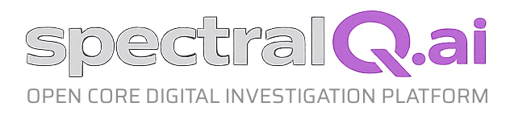

<p align="center">
  
</p>

<h1 align="center">spectralQ Core Edition</h1>

<p align="center">
  Open-source forensic trend analysis platform
</p>

<p align="center">
  <a href="#features">Features</a> &middot;
  <a href="#quick-start">Quick Start</a> &middot;
  <a href="#plugin-architecture">Plugins</a> &middot;
  <a href="#license">License</a>
</p>

---

**spectralQ Core Edition** is a self-hosted platform for monitoring and analyzing geospatial, environmental, and digital trends. It combines real-time data collection through Watch Zone plugins with statistical analysis tools, all accessible via a multilingual web interface.

## Features

- **21 Watch Zone Plugins** -- Collect and visualize data from diverse sources: seismic activity, radiation levels, weather, satellite imagery, nightlights, migration patterns, NDVI vegetation, website changes (Wayback Machine), aircraft tracking, vessel tracking, traffic flow, cell tower activity, air quality, power grid status, ACLED conflict data, OpenStreetMap changes, Telegram monitoring, Bluesky monitoring, certificate transparency (CertWatch), Wayback CDX, Wikipedia edits, and Censys scans.

- **9 Analysis Plugins** -- Run statistical methods on collected data: forecasting (Prophet), outlier detection, change point detection (CPD), Granger causality, rolling correlation, FFT spectral analysis (period filter), spike coincidence, self-similarity (SSIM), and RQ clustering.

- **Multilingual** -- Full i18n support for German, English, French, and Spanish. Each plugin ships its own translation file.

- **Plugin System** -- Drop-in plugin architecture. Watch Zone and Analysis plugins are self-contained directories with their own templates, static assets, and i18n files. Extend the platform without modifying core code.

- **Alerts & Transport** -- Configurable alerting with pluggable transport layer for notifications.

## Quick Start

```bash
# Clone the repository
git clone https://github.com/your-org/spectralq-core.git
cd spectralq-core

# Create and activate a virtual environment
python3 -m venv venv
source venv/bin/activate

# Install dependencies
pip install -r requirements.txt

# Configure environment
cp .env.example .env
# Edit .env with your API keys and settings

# Run the application
python app.py
```

The application will be available at `http://localhost:5000`.

For production deployments, use Gunicorn:

```bash
gunicorn -w 4 -b 0.0.0.0:5000 app:app
```

Or use Docker:

```bash
docker compose up -d
```

<p align="center">
  <em>Screenshot placeholder -- add a screenshot of the dashboard here.</em>
</p>

## Plugin Architecture

Plugins live under `plugins/` in two categories:

```
plugins/
  base.py                  # BasePlugin class
  watchzone/               # Data collection plugins
    seismic/
      __init__.py           # Plugin class (extends BasePlugin)
      i18n.json             # Translations (de/en/fr/es)
      templates/_panel.html # Dashboard panel template
      static/               # JS/CSS assets (optional)
    vessel/
    aircraft/
    ...
  analysis/                # Statistical analysis plugins
    forecast/
      __init__.py
      i18n.json
      templates/_modal.html
    outlier/
    cpd/
    ...
```

Each plugin:

- Extends `BasePlugin` and sets `plugin_type` and `plugin_id`
- Declares metadata (label, icon, color, required credentials)
- Provides its own i18n translations
- Ships its own Jinja2 templates and static assets
- Can define custom routes via `_routes.py`
- Can define custom transport via `_transport.py`

Plugins are auto-discovered at startup. No registration in core code required.

## Core vs. Enterprise

spectralQ Core Edition is the **fully functional open-source base platform** for data collection, visualization, and statistical analysis. It does **not** include AI-powered features.

| Feature | Core (AGPL-3.0) | Enterprise |
|---------|:---:|:---:|
| Watch Zone Plugins (21) | ✓ | ✓ |
| Analysis Plugins (9) | ✓ | ✓ |
| Multilingual (de/en/fr/es) | ✓ | ✓ |
| Plugin System | ✓ | ✓ |
| Alerts & Monitoring | ✓ | ✓ |
| AI Trend Analysis | — | ✓ |
| AI Project Assistance (Agentic) | — | ✓ |
| AI Keyword Suggestions | — | ✓ |
| AI Report Generation | — | ✓ |
| AI Scientific Paper | — | ✓ |
| Multi-User / Roles / Quotas | — | ✓ |

AI plugins communicate through the same plugin API and are subject to their own license. The Core Edition can be extended with custom or third-party AI plugins at any time.

For Enterprise licensing, contact [Steven Broschart](https://broschart.net).

## Tech Stack

| Component | Technology |
|-----------|------------|
| Backend | Flask, SQLAlchemy, APScheduler |
| Database | SQLite |
| Maps | Leaflet |
| Charts | Chart.js, Matplotlib |
| Forecasting | Prophet, statsmodels |
| Scraping | Playwright |
| Server | Gunicorn |

## License

spectralQ Core Edition is licensed under the **GNU Affero General Public License v3.0 (AGPL-3.0)** with a **Plugin Exception**.

The Plugin Exception permits third-party plugins (placed in `plugins/`) to use any license of their choice, provided they interact with spectralQ Core only through the documented plugin API (`BasePlugin` and its subclasses). The core platform itself remains AGPL-3.0.

See [LICENSE](LICENSE) for the full license text.

## Author

Created by [Steven Broschart](https://broschart.net).

---

<p align="center">
  <sub>spectralQ Core Edition &middot; Forensic Trend Analysis</sub>
</p>
